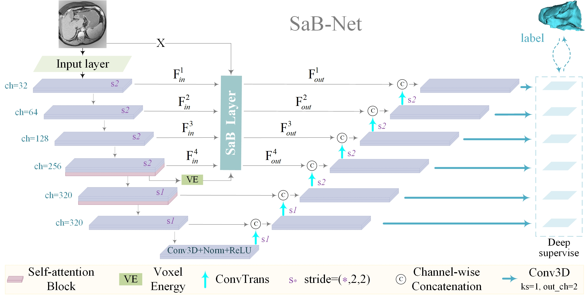

# SaB-Net: Self-attention backward network for gastric tumor segmentation in CT images

## Overview
We provide the PyTorch implementation of our CIBM submission ["SaB-Net"](https://doi.org/10.1016/j.compbiomed.2023.107866).



## Files description
SaB-Net contains the following folders:


├── data  &nbsp;&nbsp;&nbsp;&nbsp; \\ Reference to data>README.md file for detail  
&nbsp;&nbsp;&nbsp;&nbsp;&nbsp;&nbsp;&nbsp;&nbsp;&nbsp;&nbsp;├── SaB_processed &nbsp;&nbsp;&nbsp;&nbsp;\\ A folder to save the processed dataset  
&nbsp;&nbsp;&nbsp;&nbsp;&nbsp;&nbsp;&nbsp;&nbsp;&nbsp;&nbsp;├── SaB_raw\
&nbsp;&nbsp;&nbsp;&nbsp;&nbsp;&nbsp;&nbsp;&nbsp;&nbsp;&nbsp;&nbsp;&nbsp;&nbsp;&nbsp;&nbsp;&nbsp;&nbsp;&nbsp;&nbsp;&nbsp;├── Dataset001_GTS  &nbsp;&nbsp;&nbsp;&nbsp;\\ A raw data folder for a dataset  
&nbsp;&nbsp;&nbsp;&nbsp;&nbsp;&nbsp;&nbsp;&nbsp;&nbsp;&nbsp;&nbsp;&nbsp;&nbsp;&nbsp;&nbsp;&nbsp;&nbsp;&nbsp;&nbsp;&nbsp;└── ......  
&nbsp;&nbsp;&nbsp;&nbsp;&nbsp;&nbsp;&nbsp;&nbsp;&nbsp;&nbsp;└── SaB_results &nbsp;&nbsp;&nbsp;&nbsp;\\ A folder to store the trained dataset results  
└── src  
&nbsp;&nbsp;&nbsp;&nbsp;&nbsp;&nbsp;&nbsp;&nbsp;&nbsp;&nbsp;├── execution &nbsp;&nbsp;&nbsp;&nbsp;\\ store the running scripts  
&nbsp;&nbsp;&nbsp;&nbsp;&nbsp;&nbsp;&nbsp;&nbsp;&nbsp;&nbsp;├── network &nbsp;&nbsp;&nbsp;&nbsp;\\ store the model  
&nbsp;&nbsp;&nbsp;&nbsp;&nbsp;&nbsp;&nbsp;&nbsp;&nbsp;&nbsp;└── scripts  &nbsp;&nbsp;&nbsp;&nbsp;\\ functional codes  


## Usage

### Install requirements

pip install -r requirements.txt

### Preprocess
```python
python execution/preprocess.py -r [SaB_raw folder] -p [SaB_processed folder] -D [dataset_ID] 
```

### Predict
```python
python execution/predict.py -i [input_folder] -o [output_folder] -r [SaB_results folder] -d [cpu|gpu] -D [dataset_ID]
```

### Train   
Working on. Put the model into the nnUNet framework for training.
